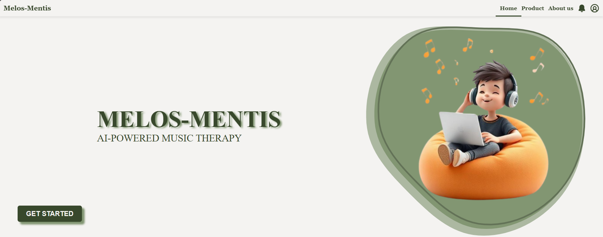
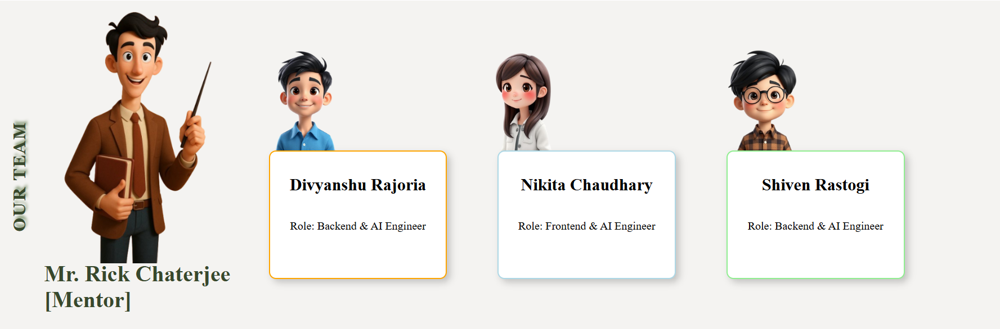
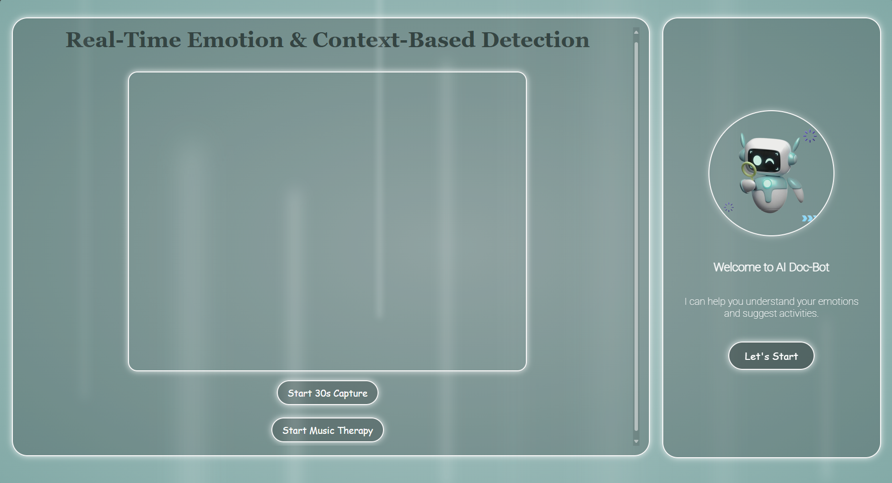

# 🎵 Melos Mentis: AI-Powered Music Therapy 🎶

**Enhancing emotional well-being through real-time AI-driven music therapy based on emotion and context detection.**

---

## 📘 Overview

**Melos Mentis** is a smart therapeutic system that uses real-time facial emotion recognition and environmental context analysis to generate adaptive, personalized music. It integrates custom deep learning models and a conversational AI chatbot to create immersive and emotionally aware therapy sessions.

---

## 🖼️ Screenshots

### Homepage

### Our Team

### Dashboard

---

## 📑 Final Progress Report

📄 View our complete report here:  
[🧾 Melos-Mentis-Final-Progress-Report.pdf](Melos-Mentis-Final-Progress-Report.pdf)

---

## 🚀 Features

- 🎭 **Emotion Detection** – Custom VGG16 model trained on FER2013
- 🌆 **Context Awareness** – Real-time object detection using YOLOv5s
- 🎧 **AI-Generated Music** – Emotion-aligned music created using Fal.AI
- 🤖 **Therapeutic Chatbot** – Empathetic AI powered by Mistral 7B with RAG
- 🌐 **Full-stack Integration** – Flask, FastAPI, MongoDB, HTML/CSS/JS

---

## 🧠 System Architecture

1. **Input**: User emotion via webcam & environmental data via camera
2. **Processing**:
   - Emotion classification (VGG16)
   - Context detection (YOLOv5s)
   - Prompt generation (Mistral 7B)
3. **Output**:
   - Emotionally intelligent conversation
   - Custom music playback (Fal.AI)
   - Visual feedback via web interface

---

## 🛠 Tech Stack

| Layer       | Tools/Frameworks                        |
|-------------|-----------------------------------------|
| Frontend    | HTML, CSS, JavaScript                   |
| Backend     | Flask, FastAPI                          |
| AI Models   | VGG16, YOLOv5s, Mistral 7B (RAG)        |
| Music Gen.  | Fal.AI                                  |
| Database    | MongoDB                                 |
| Dev Tools   | VS Code, Git, GitHub                    |

---

## 📈 Milestones Achieved

- ✅ Emotion & object detection with >90% accuracy
- ✅ Real-time music generation & emotion adaptation
- ✅ Fully integrated chatbot therapist
- ✅ Seamless web interface with login, detection, and interaction
- ✅ User personalization with MongoDB

---

## 🔮 Future Scope

- 📱 Mobile version
- 🗣️ Voice-based input
- 🎨 Dynamic visual effects
- 📊 Advanced user analytics dashboard

---

## 👨‍💻 Contributors

- **Nikita Chaudhary** – [GitHub](https://github.com/nikitac22)  
- **Shiven Rastogi**  
- **Divyanshu Rajoria**

---

> ⭐ _If you like our project, please give it a star!_
